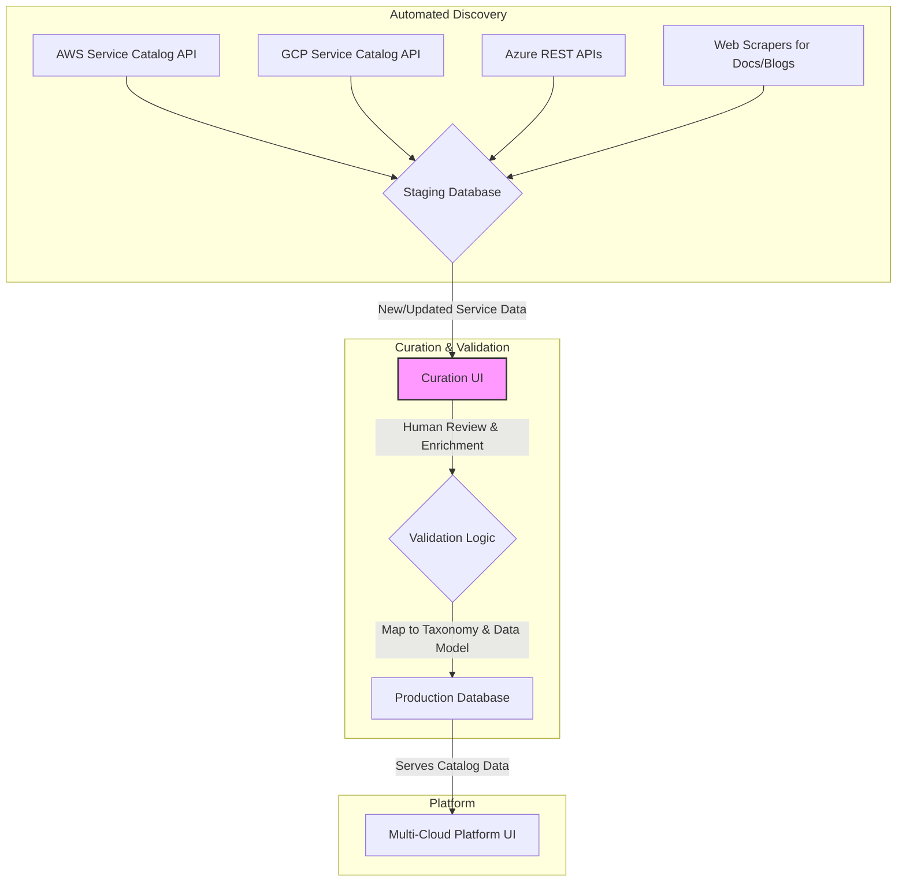

# **Plan: Architectural Framework for a Multi-Cloud Management Platform**

This plan outlines the design for a comprehensive and scalable architectural framework to catalog, categorize, and visualize cloud services from AWS, GCP, and Azure.

## **1. Cloud-Agnostic Taxonomy**

The first step is to create a function-first, hierarchical taxonomy. This will be the conceptual backbone of the platform, allowing for logical grouping and comparison of services.

**High-Level Categories & Sub-categories:**

- **Compute**
  - Virtual Machines
  - Managed Kubernetes
  - Serverless Functions
  - Container Instances
- **Storage**
  - Object Storage
  - Block Storage
  - File Storage
  - Archive Storage
- **Networking**
  - Virtual Networks
  - DNS
  - Load Balancing
  - Content Delivery Network (CDN)
  - API Gateway
- **Databases**
  - Relational (SQL)
  - NoSQL: Key-Value
  - NoSQL: Document
  - In-Memory Cache
- **AI/ML**
  - ML Platform
  - Vision
  - Language
- **Security & Identity**
  - Identity & Access Management
  - Secrets Management
  - Firewall
- **DevOps**
  - CI/CD
  - Code Repository
  - Artifact Registry
- **Analytics**
  - Data Warehousing
  - Data Processing
  - Business Intelligence

For each sub-category, the corresponding native services from AWS, GCP, and Azure will be listed.

## **2. Component Data Model**

Next, a detailed and standardized data model for our "abstracted components" will be defined. This schema will ensure consistency across the entire catalog.

Here is a proposed YAML schema for a single component:

```yaml
- id: 'managed-kubernetes'
  abstractName: 'Managed Kubernetes'
  category: 'Compute'
  subcategory: 'Managed Kubernetes'
  description: 'Provides a managed environment for deploying, managing, and scaling containerized applications using Kubernetes.'
  useCases:
    - 'Microservices architecture'
    - 'CI/CD pipelines'
    - 'Hybrid cloud deployments'
  isBoundingBox: false
  providers:
    - provider: 'aws'
      nativeServiceName: 'Elastic Kubernetes Service (EKS)'
      serviceTier: 'Managed'
      differentiators: 'Deep integration with AWS services like IAM, VPC, and ELB.'
      limitations: 'Can have a steeper learning curve for networking and IAM configuration.'
      documentationUrl: 'https://aws.amazon.com/eks/docs/'
    - provider: 'gcp'
      nativeServiceName: 'Google Kubernetes Engine (GKE)'
      serviceTier: 'Managed'
      differentiators: 'Pioneered Kubernetes; features like Autopilot for hands-off cluster management.'
      limitations: 'Cost can scale quickly with multiple clusters.'
      documentationUrl: 'https://cloud.google.com/kubernetes-engine/docs'
    - provider: 'azure'
      nativeServiceName: 'Azure Kubernetes Service (AKS)'
      serviceTier: 'Managed'
      differentiators: 'Strong integration with Azure Active Directory and Azure DevOps.'
      limitations: 'Node image updates can sometimes lag behind the latest Kubernetes versions.'
      documentationUrl: 'https://docs.microsoft.com/en-us/azure/aks/'
```

## **3. Scalable Ingestion Architecture**

To keep the catalog current, a semi-automated ingestion pipeline will be designed. This ensures that as cloud providers evolve, the platform remains accurate and relevant.

**Architecture Diagram:**



**Process:**

1.  **Automated Discovery:** Scripts will periodically query provider APIs and scrape official documentation/blogs to detect new services or changes. This raw data is placed in a staging database.
2.  **Curation UI:** A simple internal web application will allow a human curator to review the staged data. The curator will enrich the data, map it to our established taxonomy, and fill in subjective fields like `differentiators` and `limitations`.
3.  **Validation & Commit:** The curated data is validated against our component data model schema. If it passes, it's committed to the production database, making it available to the platform.
4.  **Accommodating New Providers:** To add a new provider (e.g., Oracle Cloud), we would simply add a new data source (API client/scraper) to the "Automated Discovery" stage and a new provider option in the "Curation UI". The rest of the pipeline remains unchanged.

## **4. Intuitive Visualization and UI Strategy**

Finally, a UI strategy will be proposed to present this data effectively. This builds on the existing `infrageni` canvas and adds new views for different user goals.

1.  **Visual Solution Builder (Enhancement):**

    - This is an evolution of the existing canvas in `apps/infrageni/src/app/infrabuilder/canvas.tsx`.
    - Users will drag-and-drop the _abstract components_ (e.g., "Managed Kubernetes").
    - A new "Provider" toggle (extending the existing provider selector) will dynamically switch the icons and labels on the canvas to show the underlying native services (e.g., switching from the abstract Kubernetes icon to the EKS, GKE, or AKS icon).
    - The right-click context menu or a configuration panel will show the detailed data from our model for the selected component.

2.  **Comparison Matrix (New View):**

    - A table-based view. Rows are our abstract components (e.g., "Object Storage"). Columns are the cloud providers (AWS, GCP, Azure).
    - Cells will contain the native service name (e.g., S3, Cloud Storage, Blob Storage).
    - Clicking a cell or row would expand to show the detailed comparison points from our data model: `serviceTier`, `differentiators`, `limitations`, and a link to docs.

3.  **Filterable Catalog/Dashboard (New View):**
    - A searchable and filterable gallery of all abstract components.
    - Filters will be based on our taxonomy (`category`, `subcategory`) and `useCases`.
    - Each component will be a "card" showing its abstract name, description, and the icons of the providers that offer it. Clicking a card would lead to a detailed page with the full data model information.
