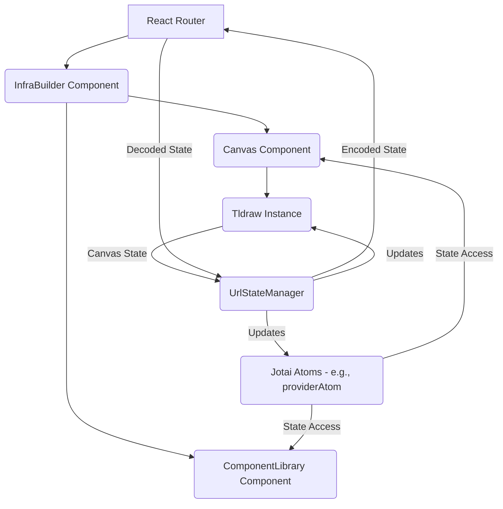

# Detailed Architecture Document: URL-Based State Management for Infra-Builder

## 1. Overview

This document outlines the design for a comprehensive URL-based state management system for the InfraGeni application's infra-builder module. The goal is to persist the canvas state, enable sharing of configurations via URLs, and improve overall application usability and performance.

## 2. Current State Analysis (Recap)

- **Canvas State:** Managed locally within `tldraw` and lost on refresh.
- **Provider State:** Managed by Jotai atoms (`providerAtom` in `components.ts`), but not reflected in URLs.
- **Routing:** Basic React Router setup (`/`, `/page-2`, `/infra-builder`).
- **Limitations:** No state serialization, compression, sharing, or deep linking. Complex `canvas.tsx` (530 lines) with tight coupling.

## 3. Proposed Architecture

The proposed architecture introduces a new `UrlStateManager` module responsible for synchronizing application state with the URL. This module will interact with `tldraw`'s internal state, Jotai atoms, and React Router.

### 3.1. Component Diagram



**Explanation:**

- **React Router:** Will be configured to accept a new URL parameter for the canvas state.
- **InfraBuilder Component:** Will orchestrate the `UrlStateManager` and pass necessary props to `Canvas` and `ComponentLibrary`.
- **Canvas Component:** Will interact with `tldraw` and receive initial state from `UrlStateManager`.
- **Tldraw Instance:** The core canvas library, whose state will be serialized/deserialized.
- **Jotai Atoms:** Existing Jotai state (e.g., `providerAtom`) will also be synchronized with the URL.
- **UrlStateManager (New Module):** The central piece, responsible for:
  - Serializing `tldraw` and Jotai state into a compact format.
  - Compressing the serialized state.
  - Encoding the compressed state into a URL parameter.
  - Decoding the URL parameter.
  - Decompressing the state.
  - Deserializing the state and applying it to `tldraw` and Jotai atoms.
  - Handling debouncing for URL updates.
  - Managing error handling for malformed URLs.

## 4. URL Parameter Structure and Compression Algorithm Design

### 4.1. URL Parameter Structure

The URL for the infra-builder will follow this structure:

`/infra-builder?canvas=<compressed_canvas_state>&provider=<compressed_provider_state>&view=<compressed_view_state>`

- **`canvas`**: Contains the serialized and compressed `tldraw` canvas state.
- **`provider`**: Contains the serialized and compressed Jotai provider state.
- **`view`**: (Optional) Contains view-specific state like zoom level, pan position, and selected elements for deep linking.

**Example:** `/infra-builder?canvas=eJz...&provider=eJz...&view=eJz...`

### 4.2. State Serialization

- **Canvas State:** `tldraw` provides methods to get and set its state (e.g., `editor.store.getSnapshot()`). This JSON object will be directly serialized.
- **Provider State:** Jotai atoms hold plain JavaScript objects. These will be directly serialized to JSON.
- **View State:** A custom object containing `zoom`, `panX`, `panY`, and `selectedShapeIds` (array of strings).

### 4.3. Compression Algorithm

Given the constraint of supporting large canvas configurations without URL length issues, a robust compression strategy is crucial.

- **Algorithm:** `LZ-String` is a suitable choice for URL-safe compression of strings. It offers good compression ratios and is specifically designed for this purpose.
- **Encoding:** The compressed string will be further encoded using `base64` (or `base64url` for URL safety) to ensure it's safe for URL parameters.

**Compression Flow:**

1.  **State Object** (e.g., `tldraw` snapshot, Jotai state)
2.  **JSON.stringify()** -> JSON String
3.  **LZ-String.compressToEncodedURIComponent()** -> Compressed & URL-safe String
4.  **URL Parameter Value**

**Decompression Flow:**

1.  **URL Parameter Value**
2.  **LZ-String.decompressFromEncodedURIComponent()** -> Decompressed JSON String
3.  **JSON.parse()** -> State Object

## 5. Architecture for Bidirectional URL ↔ State Synchronization

Synchronization will be handled by the `UrlStateManager` module, which will listen for state changes and update the URL, and also listen for URL changes to update the application state.

### 5.1. State to URL Synchronization (Write)

```mermaid
graph TD
    A[Tldraw State Change] --> B{Debounce (e.g., 500ms)}
    B --> C[Get Current Tldraw State]
    C --> D[Serialize Tldraw State]
    D --> E[Compress Tldraw State (LZ-String)]
    E --> F[Update URL Parameter 'canvas']

    G[Jotai Provider State Change] --> H{Debounce (e.g., 500ms)}
    H --> I[Get Current Jotai Provider State]
    I --> J[Serialize Jotai Provider State]
    J --> K[Compress Jotai Provider State (LZ-String)]
    K --> L[Update URL Parameter 'provider']

    F & L --> M[React Router: history.replaceState()]
```

**Details:**

- **Listeners:** The `UrlStateManager` will subscribe to `tldraw` state changes (e.g., `editor.addListener('change', ...)`) and Jotai atom changes (`useAtom` with a custom effect or `atomWithStorage` if applicable).
- **Debouncing:** Crucial for performance. URL updates will be debounced (e.g., 500ms) to prevent excessive history pushes during rapid state changes (e.g., dragging multiple elements).
- **Serialization & Compression:** As described in Section 4.3.
- **URL Update:** `history.replaceState()` will be used to update the URL without adding new entries to the browser history, ensuring a smooth user experience.

### 5.2. URL to State Synchronization (Read)

```mermaid
graph TD
    A[URL Change Detected (React Router)] --> B[Parse URL Parameters]
    B --> C[Extract 'canvas', 'provider', 'view' parameters]
    C --> D[Decompress 'canvas' parameter (LZ-String)]
    D --> E[Deserialize Tldraw State]
    E --> F[Apply Tldraw State (editor.store.loadSnapshot())]

    C --> G[Decompress 'provider' parameter (LZ-String)]
    G --> H[Deserialize Jotai Provider State]
    H --> I[Update Jotai Provider Atom]

    C --> J[Decompress 'view' parameter (LZ-String)]
    J --> K[Deserialize View State]
    K --> L[Apply View State (e.g., editor.setCamera(), editor.setSelectedShapes())]

    F & I & L --> M[Application State Updated]
```

**Details:**

- **URL Listener:** React Router's `useLocation` and `useSearchParams` hooks will be used to detect URL changes and extract parameters.
- **Deserialization & Decompression:** As described in Section 4.3.
- **State Application:**
  - `tldraw` state will be applied using `editor.store.loadSnapshot()`.
  - Jotai provider state will be updated by setting the `providerAtom`.
  - View state (zoom, pan, selected elements) will be applied using `tldraw` editor methods.
- **Loading State:** A temporary loading state or spinner should be displayed while the state is being deserialized and applied, especially for large configurations. This prevents flickering and ensures a smooth user experience.

## 6. Error Handling Strategy for Malformed URLs and Invalid State

Robust error handling is essential for a production-ready system.

- **Invalid URL Parameters:**
  - **Detection:** `try-catch` blocks around `LZ-String.decompressFromEncodedURIComponent()` and `JSON.parse()`.
  - **Recovery:** If decompression or parsing fails, the application should:
    - Log the error to the console (for debugging).
    - Display a user-friendly error message (e.g., "Invalid diagram URL. Loading default state.").
    - Load a default, empty canvas state and reset the provider state to its initial values.
    - Optionally, clear the malformed URL parameters from the URL using `history.replaceState()` to prevent persistent errors.
- **Invalid Tldraw State:**
  - **Detection:** `tldraw`'s `editor.store.loadSnapshot()` might throw errors for malformed snapshots.
  - **Recovery:** Similar to invalid URL parameters, revert to a default canvas state.
- **Invalid Jotai State:**
  - **Detection:** Type validation (e.g., Zod, Yup) can be used after `JSON.parse()` to ensure the deserialized object conforms to the expected Jotai atom type.
  - **Recovery:** Reset the specific Jotai atom to its default value.
- **User Feedback:** Implement clear visual feedback (e.g., toast notifications, error banners) to inform the user about any issues with loading the state from the URL.

## 7. Migration Strategy for Backward Compatibility

To ensure existing links continue to work, a migration strategy is needed.

- **Versioned URL Parameter:** Introduce a versioning scheme for the URL state.
  - Example: `/infra-builder?v=1&canvas=...`
  - When loading, check the `v` parameter. If `v` is missing or an older version, apply a migration function.
- **Migration Function:** A function that takes an old state format and transforms it into the new format. This function would reside in the `UrlStateManager` module.
  - Initially, `v=1` would be the current version. If a new format is introduced (e.g., `v=2`), the migration function would handle transforming `v=1` data to `v=2`.
- **Graceful Degradation:** If migration fails or an unknown version is encountered, fall back to loading a default empty state with an appropriate error message.

## 8. Performance Optimization Approach

- **Debouncing URL Updates:** As mentioned in Section 5.1, debounce updates to the URL to prevent excessive history pushes. A `setTimeout` with a configurable delay (e.g., 500ms) is appropriate.
- **Lazy Loading:**
  - **Tldraw:** The `Tldraw` component itself is likely a large bundle. Ensure it's lazy-loaded using `React.lazy` and `Suspense` if not already.
  - **State Loading:** Display a loading indicator while the state is being fetched, decompressed, and applied, especially for large diagrams. This prevents the UI from freezing.
- **Selective State Updates:** When applying state from the URL, ensure that `tldraw` and Jotai are updated efficiently. `tldraw`'s `editor.store.loadSnapshot()` is designed for this. For Jotai, directly setting the atom value is efficient.
- **Memoization:** Use `React.memo` for components that receive state from the URL but don't need to re-render on every minor change.
- **Web Workers (Future Consideration):** For extremely large canvas configurations, consider offloading the compression/decompression and JSON parsing to a Web Worker to prevent blocking the main thread. This is a more advanced optimization and can be considered in a later phase.

## 9. Deep Linking Support for Specific Canvas Sections/Components

Deep linking will allow users to share URLs that point to specific parts of the canvas or highlight certain components.

- **URL Parameter:** The `view` parameter (e.g., `&view=eJz...`) will contain serialized and compressed view state.
- **View State Data:**
  - `zoom`: Current zoom level of the canvas.
  - `panX`, `panY`: Current pan position (x, y coordinates of the top-left corner of the viewport).
  - `selectedShapeIds`: An array of `TLShapeId`s to be selected/highlighted on load.
- **Implementation:**
  - When a deep link is loaded, the `UrlStateManager` will parse the `view` parameter.
  - It will then use `editor.setCamera({ x: panX, y: panY, z: zoom })` to adjust the viewport.
  - It will use `editor.setSelectedShapes(selectedShapeIds)` to highlight the specified shapes.
- **User Interaction for Deep Linking:**
  - A "Share" button or similar UI element could be added to the toolbar.
  - When clicked, it would generate the current URL with the serialized canvas, provider, and view state, and copy it to the clipboard.

## 10. Implementation Roadmap

### Phase 1: Core URL State Management (MVP)

- **Task 1.1:** Create `UrlStateManager` module.
- **Task 1.2:** Implement `tldraw` state serialization/deserialization using `editor.store.getSnapshot()` and `editor.store.loadSnapshot()`.
- **Task 1.3:** Implement LZ-String compression/decompression for `canvas` state.
- **Task 1.4:** Integrate `UrlStateManager` with React Router to read `canvas` parameter on load.
- **Task 1.5:** Implement debounced URL updates for `tldraw` state changes using `history.replaceState()`.
- **Task 1.6:** Basic error handling for malformed `canvas` URL parameter (load default state).

### Phase 2: Provider State & Basic Error Handling

- **Task 2.1:** Extend `UrlStateManager` to handle Jotai provider state serialization/deserialization.
- **Task 2.2:** Implement LZ-String compression/decompression for `provider` state.
- **Task 2.3:** Integrate `UrlStateManager` to read `provider` parameter on load and update Jotai atom.
- **Task 2.4:** Implement debounced URL updates for Jotai provider state changes.
- **Task 2.5:** Enhance error handling with user feedback for both `canvas` and `provider` parameters.

### Phase 3: Deep Linking & Advanced Features

- **Task 3.1:** Implement `view` state serialization/deserialization (zoom, pan, selected shapes).
- **Task 3.2:** Integrate `UrlStateManager` to read `view` parameter and apply to `tldraw` editor.
- **Task 3.3:** Add UI for generating shareable deep links (e.g., "Copy Link" button).
- **Task 3.4:** Implement migration strategy for backward compatibility (versioning).
- **Task 3.5:** Explore and implement further performance optimizations (e.g., Web Workers if necessary).
